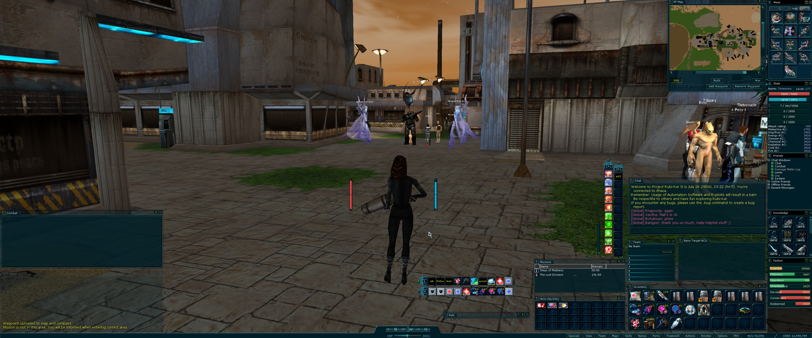
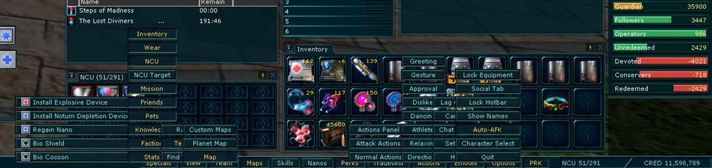
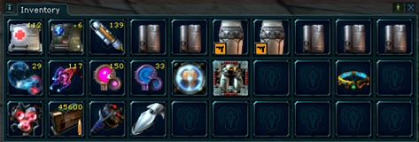
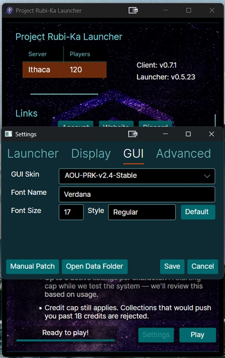
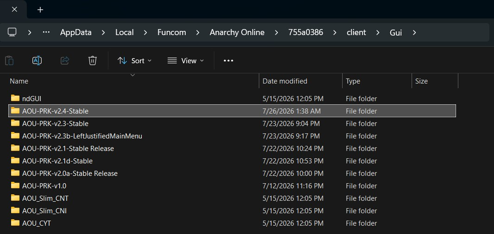

# Project-Rubi-Ka-GUI

A clean, OEM+ dark-teal GUI skin for Anarchy Online and Project Rubi-Ka, built from the AOU layout.

Project Rubi-Ka GUI keeps the original AO visual language intact while making the HUD easier to read at modern resolutions. The goal is simple: it should feel like a sharper, more cohesive version of the UI Funcom could have shipped.

**Current release — v2.4**

Download the current build:

[Download AOU-PRK v2.4 Stable](https://github.com/stealth-prk/Project-Rubi-Ka-GUI/releases/download/v2.4/AOU-PRK-v2.4-Stable.zip)

**Highlights**

Dark-teal OEM+ AOU styling with subtle cyan accents
Recolored original AO action bars — original geometry retained
Inventory, NCU, action-bar, and pet NCU slot styling
Vanilla AO cursor family
Refined target health bars with threat colors preserved
12px player Health, Nano, XP, and Alien XP bars with unified, color-matched end caps
Aligned compass and Agg/Def presentation
Improved submenu contrast: cyan normal text, amber selected state
Larger Available Improvement Points header/number in the Skills window
Cleaner high-contrast attack timer

**Screenshots**

**Installation**

Download one of the ZIP files from the latest release.
Extract the included GUI folder into your AO client's Gui directory:

1) Open PRK Launcher
2) Click "Settings"
3) Navigate to "GUI" Tab
4) Click "Open Data Folder"
5) Navigate to "GUI" Folder
6) Extract folder and contents into "GUI" Folder
7) Restart PRK Launcher 
8) Navigate back to "GUI" Tab
9) In the "GUI Skin" menu, select the latest stable release. 
10) Click "Save"
11) GUI will now load in upon launch.

Screenshots for reference: 

**Notes**

Designed and tested at 3440 × 1440.
Uses RGB-only sprite assets to avoid AO transparency/artifact issues.
The Wear window is intentionally left vanilla.
The stock AO/AOU submenu tooltip-overlay behavior is engine-side and may occur in unmodified AOU-derived skins as well.

**Compatibility**

This project is a fan-made GUI skin. It requires an Anarchy Online installation; original game assets remain the property of Funcom.
